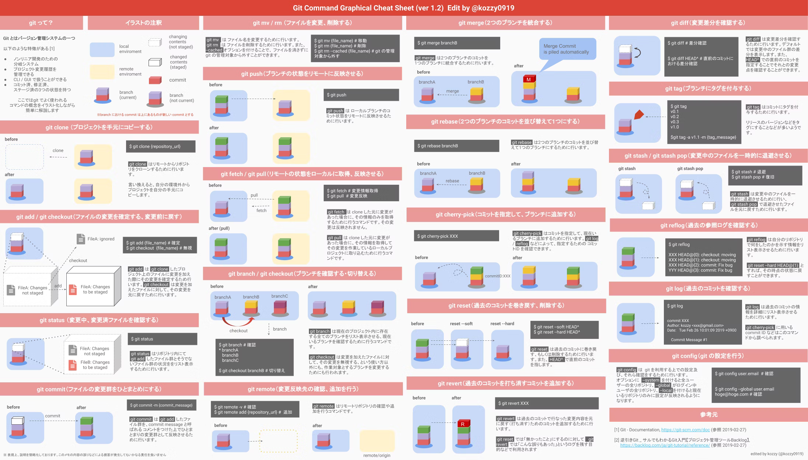

<!-- 
_backgroundColor: black
_color: white
_class: title
-->

<script type="module">
  import mermaid from 'https://cdn.jsdelivr.net/npm/mermaid@latest/dist/mermaid.esm.min.mjs';
  mermaid.initialize({ startOnLoad: true });
</script>

# gitの動作を理解する。

コミット、ブランチを詳しく知る
繰り返しの部分もありますが少し座学にお付き合いください。

---
<!-- _class: subTitle -->
# コミットとは？

変更の記録を行う。

---

# Gitの基本: コミットとは？

前にも説明しましたがコミットは、変更を記録するスナップショットのようなものです。

- ファイルの変更履歴を保存
- 変更内容にメッセージを付けられる
- `git commit -m "メッセージ"`

<pre class="mermaid">
gitGraph
  commit id: "最初のコミット"
</pre>


---

# コミットが持つ情報

コミットは以下の情報を持っています。

- **コミットハッシュ**: 一意の識別子
- **Author (作成者)**: 誰がコミットしたか
- **Date (日付)**: コミットの作成日時
- **Commit Message**: 変更の説明
- **Parent (親コミット)**: 直前のコミット

```sh
git log --pretty=fuller
```

<pre class="mermaid">
gitGraph
  commit id: "コミットA"
  commit id: "コミットB"
  commit id: "コミットC (最新)"
</pre>

---

# コミット履歴の連続性

- すべてのコミットは **親コミット (Parent)** を持つ
- Parent をたどることで **必ず最古のコミットまで遡れる**

<pre class="mermaid">
gitGraph
  commit id: "最古のコミット"
  commit id: "中間のコミット"
  commit id: "最新のコミット"
</pre>

どんなにブランチで分岐してても最古は一つ！


---

# コミットの作成手順

1. 変更を加える (`git add`)
2. コミットを作成 (`git commit -m "メッセージ"`)

```sh
git add ファイル名
git commit -m "変更内容を説明するメッセージ"
```

<pre class="mermaid">
gitGraph
  commit id: "変更Aを追加"
</pre>

これは知っての通りですね♪

---
<!-- _class: subTitle -->
# ブランチとは？

特定のコミットからの分岐

---
# Gitの基本: ブランチとは？

ブランチはコミットの流れを分岐させる仕組みです。


```sh
git branch feature-x
```

<pre class="mermaid">
gitGraph
  commit id: "最初のコミット"
  branch feature-x
  checkout feature-x
  commit id: "featureの変更"
</pre>

ChatGPTさんが謎のfeature-xブランチを作る手順を教えてくれているところｗ

---

# ブランチの情報

ブランチは以下の情報を持っています。

- **ブランチ名**: `main`, `feature` など
- **現在のHEAD**: どのコミットを指しているか
- **リモートとの関係**: `origin/main` など

```sh
git branch -v
```

<pre class="mermaid">
gitGraph
  commit id: "mainのコミット"
  branch feature
  checkout feature
  commit id: "featureの変更"
</pre>

---

# ブランチの削除

- マージ後、不要になったブランチは削除可能

```sh
git branch -d feature
```

<pre class="mermaid">
gitGraph
  commit id: "mainのコミット"
  commit id: "featureの変更"
</pre>

---
# ブランチのマージ

既に一般的なビジネス用語化している気がしますが、ここでの意味は、複数のブランチを一つに統合する操作です。通常、開発作業を別々のブランチで行い、作業が完了した後にその変更を一つのブランチに統合するために使用します。マージを行うことで、異なるブランチでの作業内容を一つにまとめ、最終的にmainブランチに反映させます。

```bash
git checkout main
git merge feature-x
```
<pre class="mermaid">
gitGraph
  commit id: "mainのコミット"
  branch feature
  checkout feature
  commit id: "featureの変更"
  checkout main
  merge feature id: "featureをmainにマージ"
</pre>

---

<!-- _class: subTitle -->
# リモートリポジトリとのやり取り
ここでエラーとかあるある

---

# リモートへのプッシュ
プッシュは、ローカルリポジトリで行った変更をリモートリポジトリに反映させる操作です。これにより、他の開発者と変更内容を共有できるようになります。プッシュを行うことで、リモートリポジトリに自分の変更が加わり、チーム全体でその変更が利用できるようになります。

```bash
git push origin feature-x
```

---
# プルとフェッチ

複数人で作業を行っていくと当然リモートリポジトリとローカルで進み具合に差が出ます。
他の人のプッシュが作業中のリポジトリで先行した場合とかですね。

この場合ローカルリポジトリ側がリモートと合っていないため、プッシュを行おうとしてもエラーになります。まずはリモートの最新の変更をローカルに取り込んでからプッシュを行う必要があります。

このリモートリポジトリの変更を取り込むために`git pull`または`git fetch`を利用します。

---
# git pull / git fetch

## `git pull` と `git fetch` の違い

| コマンド  | 動作                                               | 
| --------- | -------------------------------------------------- | 
| git pull  | git fetch + git merge（自動的に変更を統合）        | 
| git fetch | リモートの変更を取得するが、ローカルには適用しない | 

ということで`git fetch`から説明します！

---
# git fetch

## どのような動作をしているのか？

<pre class="mermaid">
gitGraph
  commit id: "ローカル: A"
  commit id: "ローカル: B"
  branch origin/main
  checkout origin/main
  commit id: "リモート: C"
  checkout main
</pre>

リモートリポジトリの変更点`C`を`origin/main`として取得しますがローカルのmainブランチへの適用までは行わない。

---
# git pull

## どのような動作をしているのか？
<pre class="mermaid">
gitGraph
  commit id: "ローカル: A"
  commit id: "ローカル: B"
  branch origin/main
  checkout origin/main
  commit id: "リモート: C"
  checkout main
  merge origin/main id: "マージ: C"
</pre>

`git fetch`してリモートリポジトリの変更を取得した後にその変更点を`git merge`でmainブランチに取り込みまで行います。
注意点としてはローカル側で想定外の変更点が取り込まれる可能性があります。

---

<!-- _class: center-slide -->

## ここまでで大体OK!!
そこそこちゃんと使えます！！！

---
<!-- _class: subTitle -->

# 他のユーザーと協力する。

GitHubでコードで高度な会話をしよう。

---
# フォークからプルリクまで

## GitHubでのフォークからプルリクエストの概要

GitHubで他の人のリポジトリをForkし、修正を加えてPull Requestを送る流れを説明します。  
プルリクってもうエンジニアの一般用語ですよね？ね？？

- **Fork**: 他人のリポジトリを自分のアカウントにコピー
- **Clone**: Forkしたリポジトリをローカルにダウンロード
- **修正 & Push**: 変更を加え、自分のリポジトリに反映
- **Pull Request**: 親リポジトリに変更の提案を送る

---

# GitHubでのフォークとは？

フォークとは、他人のリポジトリをコピーして自分のGitHubアカウントに作成する機能です。

- 他の人のプロジェクトを編集・改良できる
- オリジナルのリポジトリに影響を与えない
- Pull Requestを通じて変更を提案できる

<pre class="mermaid">
gitGraph
  commit id: "オリジナルリポジトリ"
  branch forked
  checkout forked
  commit id: "Forkされたリポジトリ"
</pre>

---

# ローカルで修正、変更をプッシュ

フォークしてきたリポジトリも修正変更を行う場合は基本ローカルにクローンして行いましょう。

<pre class="mermaid">
gitGraph
  commit id: "オリジナルリポジトリ"
  branch forked
  checkout forked
  commit id: "Forkされたリポジトリ"
  commit id: "forkedをクローン"
  branch local-main
  checkout local-main
  commit id: "変更を加える"
  commit id: "ローカルの修正"
  checkout forked
  merge local-main id: "mainにマージ"
</pre>

---

# Pull Request を作成

<div class="box green">

## プルリクってよく聞くけど何？
- 修正内容を親リポジトリの管理者に送るための仕組み
- 承認されるとオリジナルのリポジトリにマージされる

ちなみにGitHubではプルリクですが、GitLabではマージリクエストという名前になります。  
公式ドキュメントは[こちら](https://docs.github.com/ja/pull-requests/collaborating-with-pull-requests/proposing-changes-to-your-work-with-pull-requests/creating-a-pull-request-from-a-fork)から
</div>

<pre class="mermaid">
gitGraph
  commit id: "オリジナルリポジトリ"
  branch forked
  checkout forked
  commit id: "Forkされたリポジトリ"
  commit id: "forkedをクローン"
  branch local-main
  checkout local-main
  commit id: "変更を加える"
  commit id: "ローカルの修正"
  checkout forked
  merge local-main id: "mainにマージ"
  checkout main
  merge forked id: "merge承認"
</pre>

---
<!-- _class: center-slide -->
# まとめ

## 改めてGitHubの開発まとめ

1. Fork でリポジトリをコピー
2. Clone でローカルに取得
3. 修正 & Push で変更を反映
4. Pull Request で変更を提案

---
<!-- _class: center-slide -->
# Appendix



---
<!-- _class: center-slide -->
# Appendix
おすすめサイト！
https://backlog.com/ja/git-tutorial/
