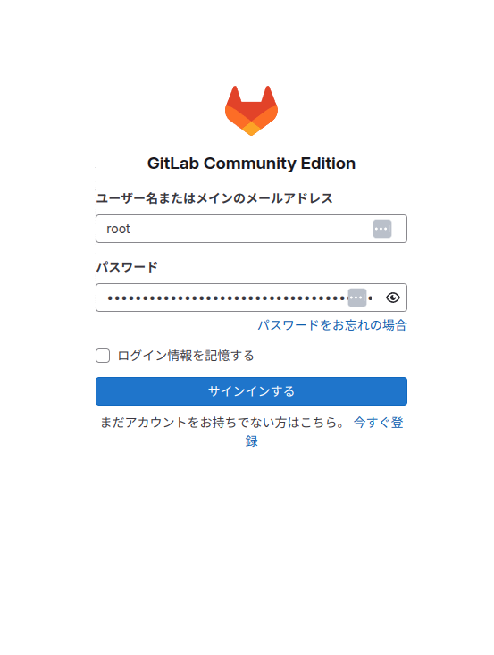
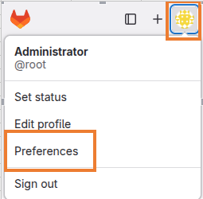
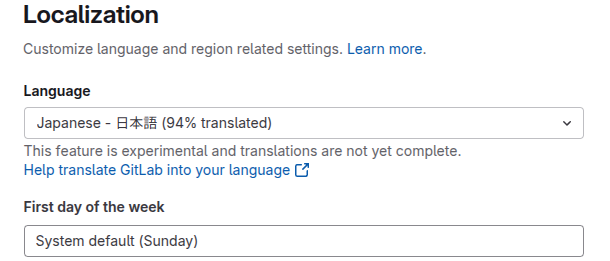
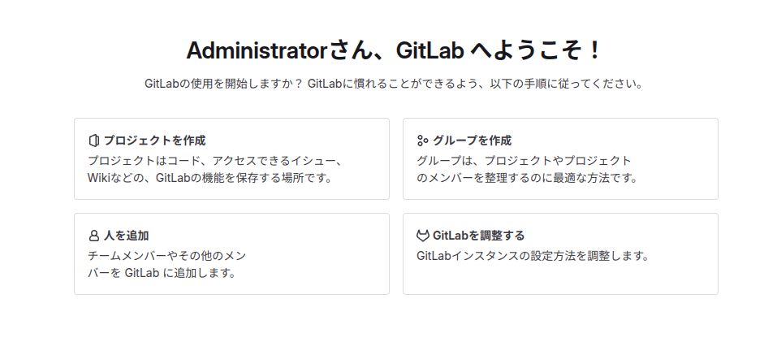

<!-- 
_backgroundColor: black
_color: white
_class: title
-->

# リモートGitサーバーの構築

## GitLabを構築しましょう。

---

<!--- _class: subTitle --->

# GitLabって他とどう違うの？
自己のホストを無料で建てられるのはGitLabぐらいという

---
# GitHub・GitLab・BitBucketの違い

<style scoped>
  table { table-layout: fixed; width: 100%; display:table; font-size: 25px; }
</style>

## 有名どころな3つのリモートリポジトリサービスについての比較

| 特徴      | GitHub | GitLab | BitBucket |
|-----------|--------|--------|-----------|
| **用途**  | OSS向け・広く普及 | CI/CD強力・エンタープライズ向け | Atlassian製・Jira連携 |
| **ホスティング** | クラウド | クラウド / オンプレミス | クラウド / オンプレミス |
| **CI/CD** | GitHub Actions | GitLab CI/CD | BitBucket Pipelines |
| **料金プラン** | 無料 / 有料 | 無料 / 有料 | 無料 / 有料 |
| **日本語対応** | 無し   | 有り | 有り |
| **特徴** | Microsoft傘下 | 独立系・自己ホスト可 | Mercurial対応（現在はGitメイン） |

---
# オンプレミスGitLabのメリット

GitLabは **クラウド版** と **オンプレミス版** の両方を提供しています。  
オンプレミス版を使用することで **セキュリティ・管理面** での利点があります。

### **メリット**
- **プライベート環境で管理**（外部に依存しない）
- **アクセス制御の自由度が高い**
- **独自のカスタマイズが可能**
- **CI/CDを内部リソースで最適化**

### **適した利用ケース**
- **機密性の高いプロジェクト**
- **社内ネットワークで開発を完結させたい場合**
- **クラウド依存を避けたい場合**

---

# GitLab構築 (Windows11 WSL2)

WSL2上のUbuntuで **GitLabのオンプレミス環境** をセットアップします。

## **1. WSL2のセットアップ**
1. WindowsでWSL2を有効化
2. `Ubuntu` をインストール
3. ターミナルで以下を実行

```powershell
wsl --install -d Ubuntu
```
---

# GitLab構築 (Windows11 WSL2)

## **2. 必要パッケージのインストール**
WSL2のUbuntuへ接続して

```bash
sudo apt update
sudo apt install -y curl openssh-server ca-certificates
```

## **3. GitLabのインストール**

```bash
curl -fsSL https://packages.gitlab.com/install/repositories/gitlab/gitlab-ce/script.deb.sh | sudo bash
sudo apt install -y gitlab-ce
```

## **4. 初期設定**

```bash
sudo gitlab-ctl reconfigure
```

数分コマンドが完了するまで待ちます。

---

# GitLab構築 (Windows11 WSL2)

## **5. rootパスワード確認**

```bash
sudo cat /etc/gitlab/initial_root_password
```

## **6. ブラウザからgitlabにログイン**

ブラウザから`http://localhost`へアクセスし、ユーザー名`root`と先ほど確認したパスワードでログインする。



---

# GitLabを利用する。

## **1. せっかくなのでまず日本語化しよう**

1. ユーザーの幾何学模様の様なアイコンをクリックし**Preferences**を選択
2. **Localization**の項目から**Language**を日本語にする。
3. **Save Changes**を押下

 


---

# GitLabを利用する。

## 日本語化完了！



---

# GitLabを利用する。

## **2. 色々触ってみよう**

トップ画面に出ている項目はまず全部実施してみましょう。

1. プロジェクトの新規作成
    - README.mdを書いてみる
2. ユーザーの追加
3. グループの追加
4. トークンとかsshの設定追加

などなど

オンプレのGitLabなので非公開のプロジェクト、リポジトリを無制限に作れるので公開したくない情報等は扱い安いですね。無料の範囲でも十分の機能があります。

---

# 本研修のまとめ

<!-- _class: center-slide -->

## gitを利用してゼヒ楽しいエンジニアライフを！